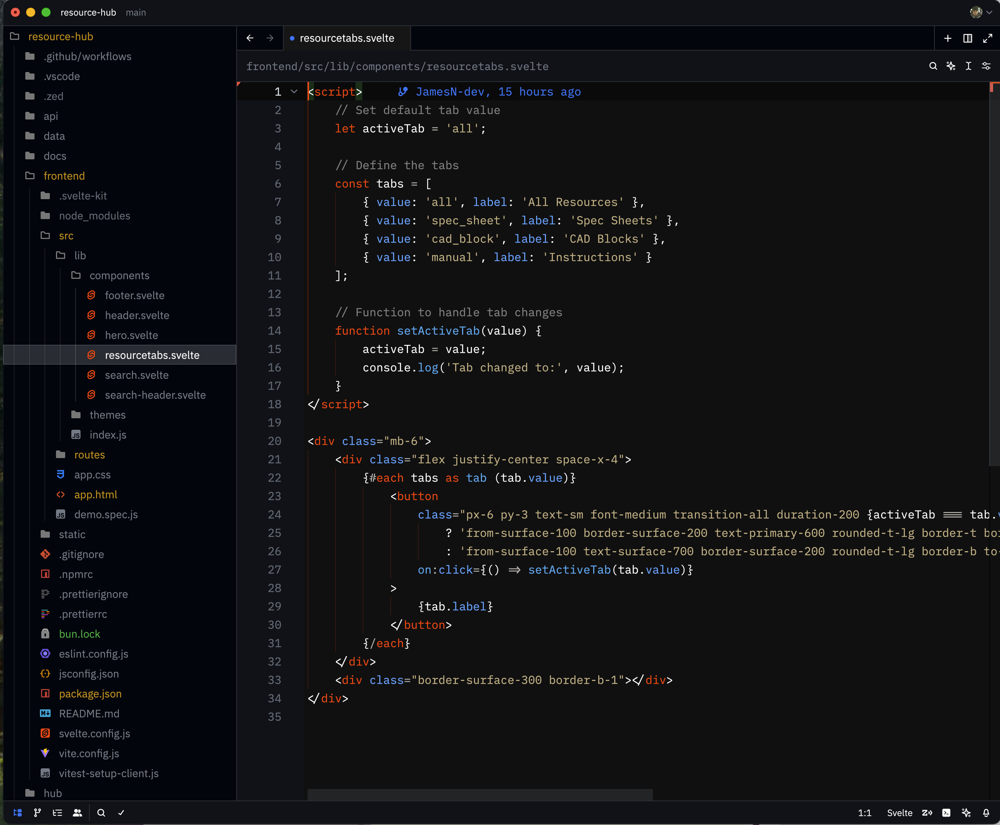

# Svelte 5 Themes for Zed

A pair of high-contrast, Svelte-branded themes for Zed inspired by the [official Svelte documentation.](https://svelte.dev/docs/kit/introduction).

- **Svelte 5 Theme Dark**: Features the iconic Svelte orange (#FF3E00) with a deep black background for reduced eye strain.
- **Svelte 5 Theme Latte**: A light variant with Svelte orange accents and a soft, warm background for daytime or high-light environments.

## Screenshots



<!-- Add a screenshot for Latte if available -->

## Manual install

1. Copy `themes/Svelte-5-Theme-Dark.json` and/or `themes/Svelte-5-Theme-Latte.json` into your Zed themes directory (usually `~/.config/zed/themes`).
2. Select your preferred theme in Zed:
   - For dark mode: **Svelte 5 Theme Dark**
   - For light mode: **Svelte 5 Theme Latte**

# Recommended Icon Themes

These themes pair well with the following Zed icon themes:

- Bearded Icons
- Catppuccin Latte

For the best experience with these themes, add the following to your settings.json file:

## Recommended Settings

Add the following to your settings.json file:

```
  "indent_guides": {
    "enabled": true,
    "line_width": 1,
    "active_line_width": 2,
    "background_coloring": "disabled"
  },
```

This will enable orange-tinted alternating indent guides that complement the Svelte branding, similar to the code blocks on the Svelte documentation.
